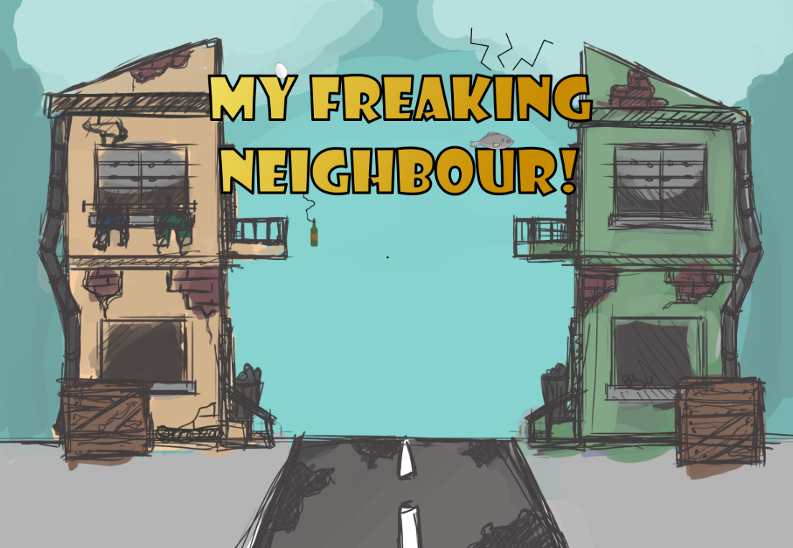
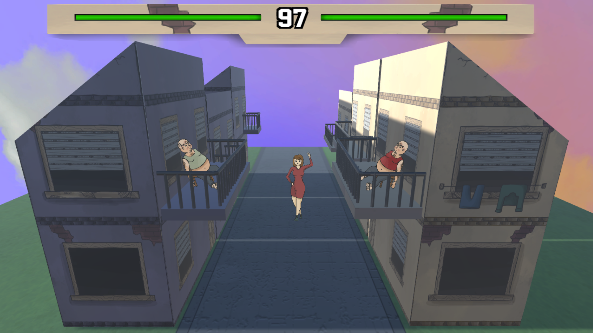

# My Freaking Neighbor!

My freaking neighbor is a game about two neighbours who absolutely despise each other. Reduce your opponent's reputation to zero in order to be crowned the best *worst* man in the neighbourhood! 

## Controls:

Player 1: W/A/S/D 
Player 2: I/J/K/L

Each key performs a specific type of taunt or attack. Be careful, as performing certain acts while someone is crossing the road may have different effects. For example, using a verbal taunt while the cute girl next door walks by may actually reduce your reputation instead of your neighbour's!

The game was developed at Global Game Jam '19. The main theme to follow was *What does home mean to me?*.

## Developers:
- André Silva - [@Andrefpvs](https://github.com/Andrefpvs)
- Denis Voicu - [@Smeurfy](https://github.com/Smeurfy)
- Francisco Henriques Venda - [@ist173839](https://github.com/ist173839)
- Samuel Gomes - [@SamGomes](https://github.com/SamGomes)

## Lead Designer:
- Andreia Batista

## Screenshot:

